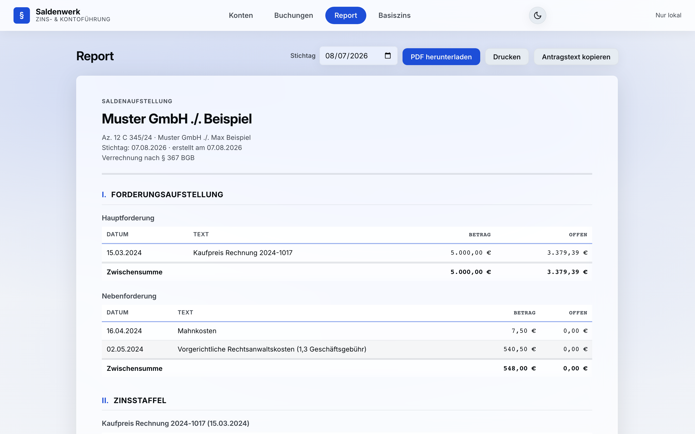
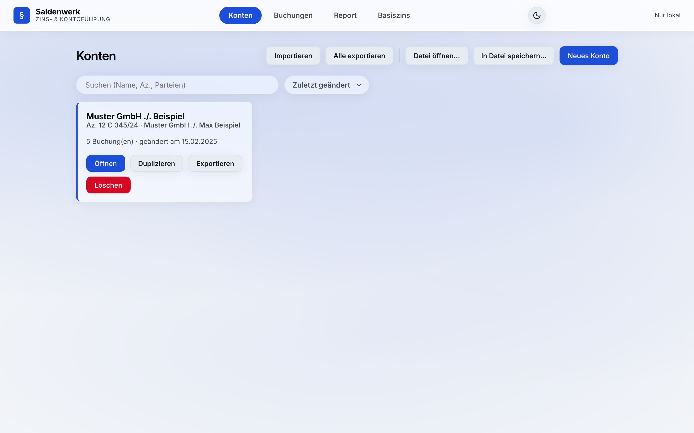
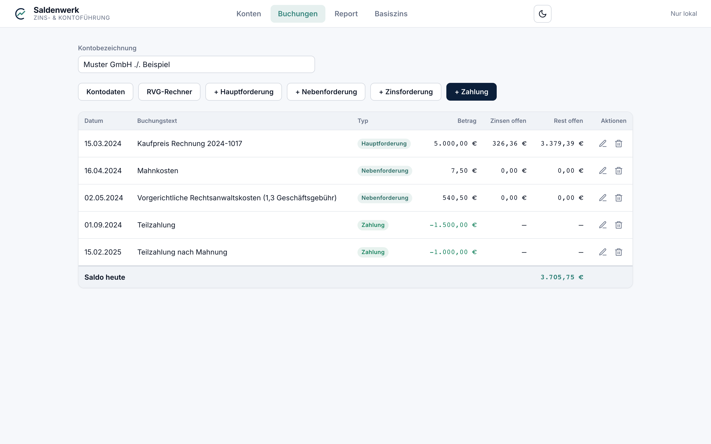
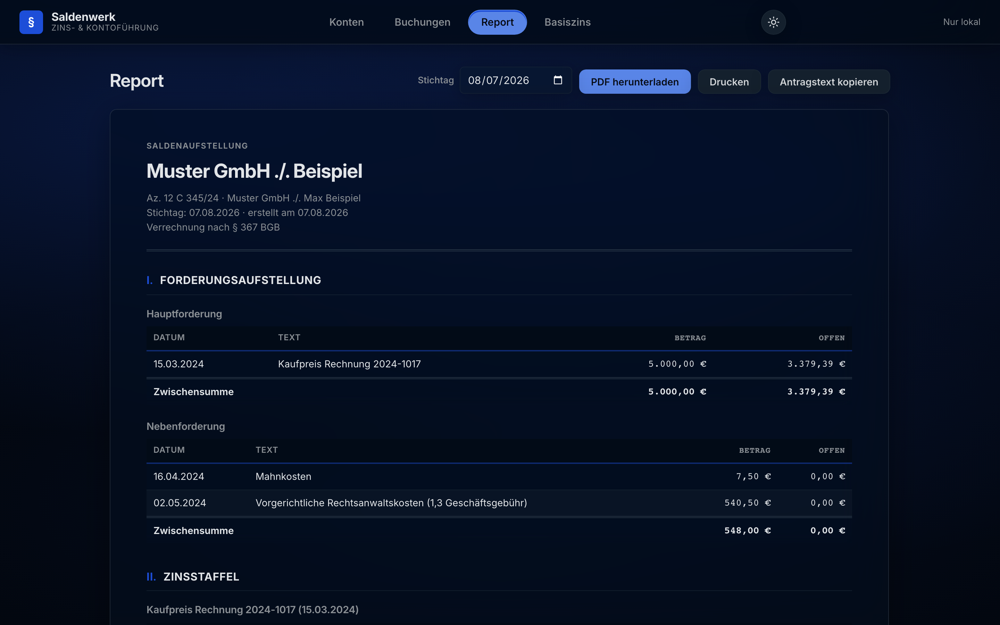

# Saldenwerk

[](https://github.com/PBaumfalk/Saldenwerk/actions/workflows/docker.yml)
[](LICENSE)
[](https://ghcr.io/pbaumfalk/saldenwerk)

**Forderungskonten führen, Verzugszinsen berechnen, Forderungsaufstellungen
erzeugen — direkt im Browser.** Saldenwerk ist ein kostenloses Werkzeug für
Kanzleien und Rechtsanwender: Hauptforderungen, Kosten und Zahlungen
erfassen, und Saldenwerk berechnet tagesgenau den offenen Saldo — mit
Zinsstaffel nach § 288/§ 247 BGB, gesetzlicher Tilgungsreihenfolge
(§ 367 / § 497 Abs. 3 BGB), RVG-Kostenrechner, PDF-Export und fertigem
Antragstext für Mahnbescheid oder Klage.

Ihre Daten bleiben dabei **komplett auf Ihrem Rechner** — kein Konto,
keine Cloud, keine Datenübertragung.

> **English abstract** — Claims-account calculator for German legal
> practice: manage receivables ledgers, compute default interest
> (§ 288 BGB, base-rate coupled), statutory attorney fees (RVG) and
> payment allocation (§ 367 / § 497 BGB). Runs entirely client-side
> (vanilla JS, no build step); ships as a static site or Docker image.
> UI and documentation are in German.



## 📖 Handbuch

Die vollständige Dokumentation aller Funktionen — verständlich für
Anwältinnen und Anwälte wie für Techniker — steht im
**[Handbuch](docs/handbuch/README.md)**: von den
[Grundbegriffen](docs/handbuch/01-was-ist-saldenwerk.md) über
[Buchungen & Verzinsung](docs/handbuch/04-buchungen.md) und den
[RVG-Rechner](docs/handbuch/05-rvg-rechner.md) bis zu den
[Rechenkonventionen](docs/handbuch/11-rechenkonventionen.md) im Detail.

## Installation

<details>
<summary><strong>🍎 Auf dem Mac</strong> (ohne IT-Kenntnisse)</summary>

1. Oben auf dieser Seite den grünen Knopf **Code** anklicken und
   **Download ZIP** wählen.
2. Die ZIP-Datei in „Downloads" doppelklicken — macOS entpackt sie zu
   einem Ordner.
3. Den Ordner z. B. nach „Dokumente" verschieben und darin die Datei
   **`index.html`** doppelklicken. Saldenwerk öffnet sich im Browser —
   fertig.

Empfohlener Browser: Chrome oder Edge (wegen der
[Datei-Speicherung](docs/handbuch/08-datenspeicherung.md)).
Ausführlich: [Handbuch, Kapitel 2](docs/handbuch/02-installation.md).
</details>

<details>
<summary><strong>🪟 Auf dem Windows-PC</strong> (ohne IT-Kenntnisse)</summary>

1. Oben auf dieser Seite den grünen Knopf **Code** anklicken und
   **Download ZIP** wählen.
2. Die ZIP-Datei mit rechts anklicken → **Alle extrahieren…** →
   z. B. nach „Dokumente".
3. Im entpackten Ordner die Datei **`index.html`** doppelklicken.
   Saldenwerk öffnet sich in Edge — fertig.

Ausführlich: [Handbuch, Kapitel 2](docs/handbuch/02-installation.md).
</details>

<details>
<summary><strong>🖥️ Auf einem Server</strong> (für IT: Docker, eine URL für die ganze Kanzlei)</summary>

Fertiges Image:

```
docker run -d -p 8090:80 --restart unless-stopped ghcr.io/pbaumfalk/saldenwerk:latest
```

Alternativ selbst bauen:

```
git clone https://github.com/PBaumfalk/Saldenwerk.git
cd Saldenwerk
docker compose up -d --build
```

HTTPS, Updates und Details:
[Handbuch, Kapitel 2](docs/handbuch/02-installation.md).
</details>

Zum Ausprobieren: [`docs/beispiel-konto.json`](docs/beispiel-konto.json)
herunterladen und in der Konten-Ansicht über „Importieren" laden.

## Funktionen im Überblick

| Konten | Buchungen |
| --- | --- |
|  |  |

- **Forderungskonten** mit vier Buchungstypen: Hauptforderung,
  Nebenforderung (Kosten), Zinsforderung, Zahlung —
  [Kapitel 3](docs/handbuch/03-konten.md) & [4](docs/handbuch/04-buchungen.md)
- **Tagesgenaue Verzinsung**: fester Zinssatz oder Basiszins + Aufschlag
  (§ 247/§ 288 BGB), Kalender- oder Bankmethode —
  [Kapitel 4](docs/handbuch/04-buchungen.md)
- **Gesetzliche Tilgungsreihenfolge** je Konto: § 367 BGB oder
  § 497 Abs. 3 BGB (Verbraucherdarlehen) —
  [Kapitel 3](docs/handbuch/03-konten.md)
- **RVG-/Mahnkosten-Rechner** (KostRÄG 2025): Geschäftsgebühr,
  Verfahrens-/Terminsgebühr, Gerichtskosten, Anrechnung, Verzugspauschale —
  [Kapitel 5](docs/handbuch/05-rvg-rechner.md)
- **Report mit Zinsstaffel**: jede Zahl nachrechenbar; **PDF-Download**
  (A4 quer, mit Salden-Diagramm), **Druck** und **Antragstext** für
  Mahnbescheid/Klage per Klick — [Kapitel 6](docs/handbuch/06-report.md)
- **Basiszins-Tabelle** ab 2002 eingebaut, eigene Werte als Overrides —
  [Kapitel 7](docs/handbuch/07-basiszins.md)
- **Datenhoheit**: alles lokal; optionale Speicherdatei auf dem
  Kanzlei-Netzlaufwerk, Export/Import als JSON —
  [Kapitel 8](docs/handbuch/08-datenspeicherung.md)
- **Hell & Dunkel**: folgt der Systemeinstellung, Umschalter in der
  App-Leiste; Druck/PDF bleiben immer schwarz auf weiß —
  [Kapitel 10](docs/handbuch/10-anpassung.md)



## Für Entwickler

Saldenwerk ist bewusst einfach gebaut: statisches Vanilla-JS ohne
Build-Schritt (`index.html` öffnen genügt), ohne Laufzeit-Abhängigkeiten
von CDNs — die einzigen Fremdbibliotheken (jsPDF, jsPDF-AutoTable, Inter)
liegen lokal in `vendor/`. Tests:

```
node --test tests/*.test.js
```

Öffentliches Hosting und eigenes Branding (Name, Logo, Farben) sind über
`konfig.js` konfigurierbar — siehe
[Handbuch, Kapitel 10](docs/handbuch/10-anpassung.md).

## Lizenz

[MIT](LICENSE) — © 2026 Patrick Baumfalk.

Gebündelte Komponenten in `vendor/`:
[jsPDF](https://github.com/parallax/jsPDF) und
[jsPDF-AutoTable](https://github.com/simonbengtsson/jsPDF-AutoTable)
(beide MIT) sowie die Schrift [Inter](https://github.com/rsms/inter)
(SIL Open Font License 1.1) — Lizenztexte liegen bei.

## Haftungsausschluss

Saldenwerk dient der technischen Unterstützung bei der Führung und
Berechnung von Forderungskonten und ersetzt keine Rechts- oder
Steuerberatung. Für die Richtigkeit der Berechnungen — insbesondere der
hinterlegten Basiszinssätze, RVG-Gebührenwerte und der daraus abgeleiteten
Beträge — wird keine Gewähr übernommen. Im Zweifel ist fachkundiger Rat
einzuholen.
