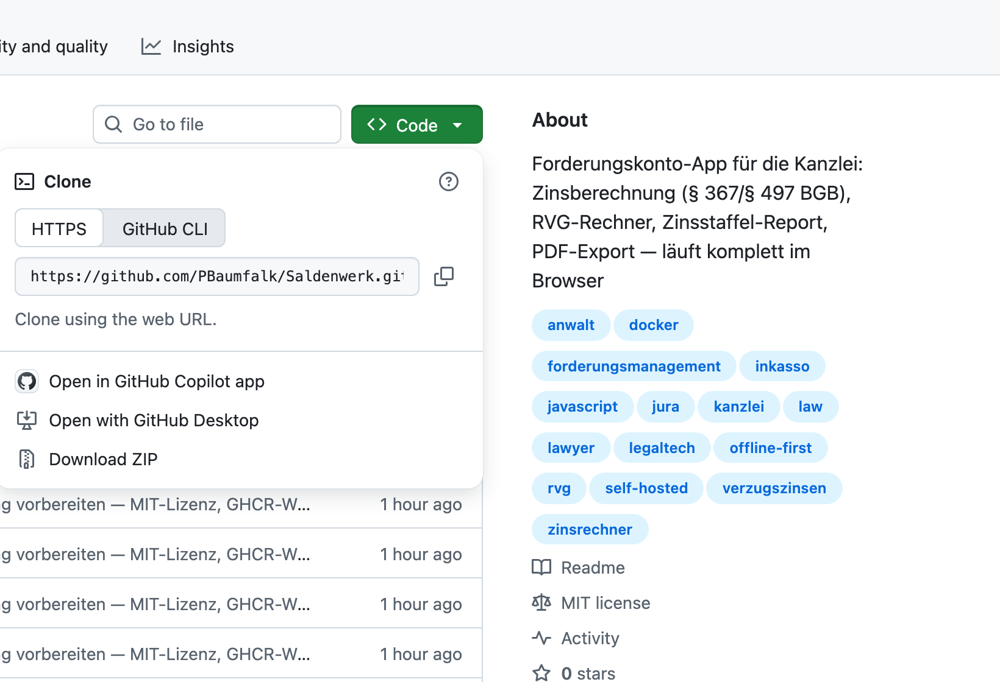

# 2 — Installation

Saldenwerk braucht **keine Installation im klassischen Sinn**: Es ist eine
Webseite, die komplett auf Ihrem Rechner läuft. Es gibt drei Wege, sie zu
nutzen — vom Doppelklick bis zum Kanzlei-Server.

**Empfohlener Browser:** Google Chrome oder Microsoft Edge. Firefox und
Safari funktionieren auch, können aber die komfortable
[Datei-Speicherung](08-datenspeicherung.md) nicht nutzen (dort hilft dann
der Export als Sicherung).

## Auf dem Mac

1. Auf der [GitHub-Seite](https://github.com/PBaumfalk/Saldenwerk) den
   grünen Knopf **Code** anklicken und **Download ZIP** wählen:

   

2. Die heruntergeladene ZIP-Datei im Ordner „Downloads" doppelklicken —
   macOS entpackt sie zu einem Ordner „Saldenwerk-main".
3. Den Ordner an einen dauerhaften Ort verschieben (z. B. in „Dokumente").
4. Im Ordner die Datei **`index.html`** doppelklicken — Saldenwerk öffnet
   sich im Browser. Fertig.

Tipp: Ziehen Sie die geöffnete Seite als Lesezeichen in die
Lesezeichenleiste, dann ist Saldenwerk künftig einen Klick entfernt.

## Auf dem Windows-PC

1. Auf der [GitHub-Seite](https://github.com/PBaumfalk/Saldenwerk) den
   grünen Knopf **Code** anklicken und **Download ZIP** wählen (Bild siehe
   oben beim Mac — der Knopf ist derselbe).
2. Die ZIP-Datei im Download-Ordner mit rechts anklicken →
   **Alle extrahieren…** → Zielordner wählen (z. B. „Dokumente").
3. Im entpackten Ordner die Datei **`index.html`** doppelklicken —
   Saldenwerk öffnet sich in Edge bzw. Ihrem Standard-Browser. Fertig.

Hinweis für beide Varianten: Ein **Update** auf eine neue Version ist
einfach das erneute Herunterladen und Ersetzen des Ordners. Ihre Daten
liegen nicht im Programmordner, sondern im Browser bzw. in Ihrer
Speicherdatei — sie überstehen das Update (Sicherung vorher schadet
trotzdem nie, siehe [Kapitel 8](08-datenspeicherung.md)).

## Auf einem Server (für IT / Administratoren)

Für Kanzleien mit mehreren Arbeitsplätzen empfiehlt sich der Betrieb als
Docker-Container: eine URL für alle, zentrale Updates.

**Schnellstart mit dem fertigen Image:**

```
docker run -d -p 8090:80 --restart unless-stopped ghcr.io/pbaumfalk/saldenwerk:latest
```

Die App ist dann unter `http://SERVER:8090` erreichbar.

**Alternativ selbst bauen** per Docker Compose:

```
git clone https://github.com/PBaumfalk/Saldenwerk.git
cd Saldenwerk
docker compose up -d --build
```

**HTTPS:** Die Datei-Speicherung (File System Access API) funktioniert nur
in sicheren Kontexten (HTTPS oder `localhost`). Ohne HTTPS läuft die App
im LAN trotzdem — die Daten liegen dann im localStorage des jeweiligen
Browsers, mit Backup-Erinnerung. Für HTTPS: Zertifikate nach
`certs/tls.crt`/`tls.key` legen und in `docker-compose.yml` die
auskommentierten Zeilen (Port 8443 + Volumes) aktivieren.

**Updates:** `git pull && docker compose up -d --build` bzw. beim
Image-Betrieb `docker pull ghcr.io/pbaumfalk/saldenwerk:latest` und den
Container neu starten. Der Container speichert selbst keine Nutzerdaten.

---

Weiter: [3 — Konten](03-konten.md) · [Zur Übersicht](README.md)
