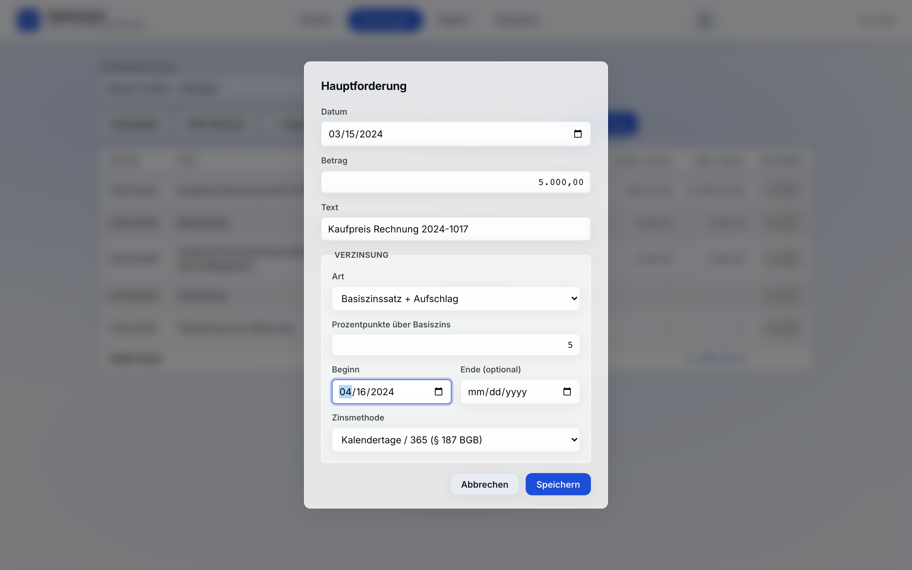

# 4 — Buchungen

In der Ansicht **Buchungen** bearbeiten Sie das geöffnete Konto. Die
Tabelle zeigt alle Buchungen chronologisch mit Betrag, offenen Zinsen und
offenem Rest; unten steht der **Saldo heute**. Über die Stift- und
Papierkorb-Symbole in der Spalte „Aktionen" lassen sich Buchungen
bearbeiten und löschen.

## Die vier Buchungstypen

| Typ | Bedeutung | Beispiel |
| --- | --- | --- |
| **Hauptforderung** | Die Grundforderung | Kaufpreis, Rechnungsbetrag, Darlehensrate |
| **Nebenforderung** | Kosten der Rechtsverfolgung | Mahnkosten, Inkassokosten, Anwalts- und Gerichtskosten |
| **Zinsforderung** | Bereits bezifferte Zinsen | Ausgerechnete Zinsen aus einem Titel oder einer früheren Aufstellung |
| **Zahlung** | Geldeingang des Schuldners | Teilzahlung, Ratenzahlung |

Zahlungen werden automatisch in der gesetzlichen
[Tilgungsreihenfolge](03-konten.md#kontodaten-aktenzeichen-parteien-tilgungsreihenfolge)
verrechnet; ein Überschuss wird als Überzahlung ausgewiesen.

## Buchung erfassen

Die Knöpfe **+ Hauptforderung**, **+ Nebenforderung**, **+ Zinsforderung**
und **+ Zahlung** öffnen den Buchungsdialog:

Die Felder im Einzelnen:

- **Datum** — bei Forderungen das Entstehungsdatum, bei Zahlungen der
  Zahltag.
- **Betrag** — mit Komma, z. B. `5.000,00` oder `540,50`.
- **Text** — die Bezeichnung, die später im Report erscheint
  (z. B. „Kaufpreis Rechnung 2024-1017").

## Verzinsung (Haupt- und Nebenforderungen)

Haupt- und Nebenforderungen können laufend verzinst werden. Im Abschnitt
**Verzinsung** des Dialogs:

- **Art**
  - *Keine* — die Forderung wird nicht verzinst.
  - *Fester Zinssatz* — unveränderlicher Satz, z. B. 4 % p. a.
  - *Basiszinssatz + Aufschlag* — der variable Basiszins nach § 247 BGB
    (ändert sich halbjährlich) zuzüglich Prozentpunkten. Für Verzugszinsen
    der Regelfall: **+ 5 Punkte** (§ 288 Abs. 1 BGB) bzw. **+ 9 Punkte**,
    wenn kein Verbraucher beteiligt ist (§ 288 Abs. 2 BGB).
- **Beginn** — der erste Zinstag (wird mitgezählt). Bei Verzug
  typischerweise der Tag nach Fälligkeit bzw. nach Zugang der Mahnung.
- **Ende (optional)** — der letzte Zinstag. Leer lassen, wenn die
  Verzinsung bis zum jeweiligen Report-Stichtag weiterläuft.
- **Zinsmethode**
  - *Kalendertage / 365 (§ 187 BGB)* — tatsächliche Tage, Jahr mit
    365/366 Tagen. Üblich für gesetzliche Verzugszinsen.
  - *Bankmethode 30/360* — jeder Monat 30 Tage, Jahr 360 Tage. Nur wenn
    vertraglich vereinbart.

Wie genau gerechnet wird (Zinstage, Rundung, Halbjahressplit), steht in
[Kapitel 11 — Rechenkonventionen](11-rechenkonventionen.md).

## Info-Texte in der Oberfläche

Viele Beschriftungen tragen kleine Hinweise: Fahren Sie mit der Maus über
Feldnamen wie „Art" oder „Beginn", zeigt ein Tooltip die juristische
Kurzerklärung direkt an Ort und Stelle.

---

Weiter: [5 — RVG-Rechner](05-rvg-rechner.md) · [Zur Übersicht](README.md)
