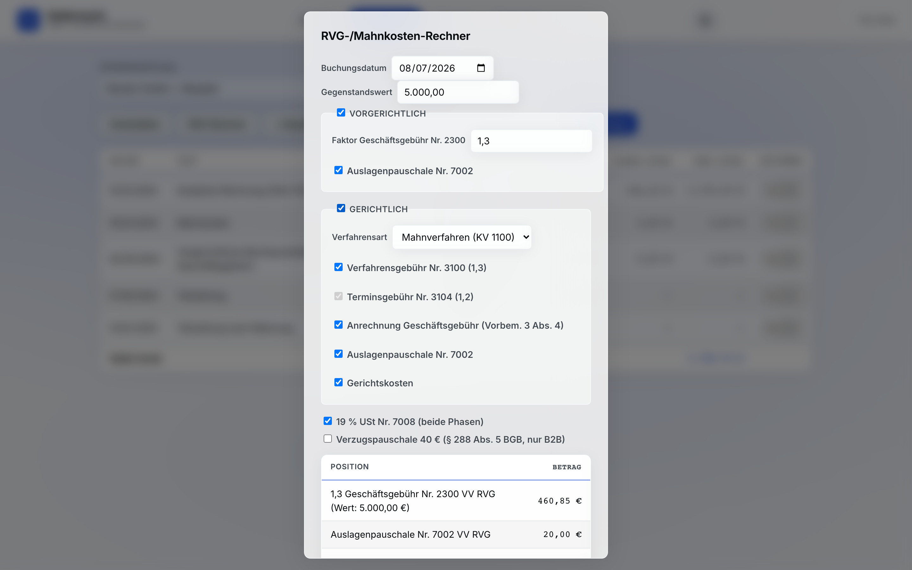

# 5 — RVG-Rechner

Der **RVG-/Mahnkosten-Rechner** (Knopf „RVG-Rechner" in der
Buchungen-Ansicht) berechnet die Kosten der Rechtsverfolgung und fügt sie
mit einem Klick als Nebenforderungs-Buchungen ins Konto ein.

## Bedienung

1. **Buchungsdatum** und **Gegenstandswert** eingeben — der
   Gegenstandswert ist in der Regel die offene Hauptforderung.
2. Die gewünschten Positionen an- oder abwählen (siehe unten). Die
   **Vorschau-Tabelle** unten im Dialog zeigt jede Position und die Summe
   live an.
3. **Buchungen einfügen** übernimmt alle Positionen als einzelne
   Nebenforderungen ins Konto — jede mit aussagekräftigem Text, sodass der
   Report sie einzeln ausweist.

## Vorgerichtliche Kosten

- **Geschäftsgebühr Nr. 2300 VV RVG** mit wählbarem Faktor
  (Rahmengebühr 0,5–2,5). Regelsatz ist **1,3** — mehr nur bei
  umfangreicher oder schwieriger Tätigkeit.
- **Auslagenpauschale Nr. 7002**: 20 % der Gebühren, höchstens 20 €.

## Gerichtliche Kosten

- **Verfahrensart**: *Mahnverfahren* (Gerichtskosten KV 1100 GKG,
  0,5-Gebühr, mindestens 38 €) oder *Klageverfahren* (KV 1210 GKG,
  3,0-Gebühr).
- **Verfahrensgebühr Nr. 3100** (1,3).
- **Terminsgebühr Nr. 3104** (1,2) — entsteht mit Wahrnehmung eines
  Termins; im Mahnverfahren gibt es keine.
- **Anrechnung der Geschäftsgebühr** (Vorbem. 3 Abs. 4 VV RVG): Die
  vorgerichtliche Geschäftsgebühr wird zur Hälfte — höchstens mit 0,75 —
  auf die Verfahrensgebühr angerechnet; Saldenwerk bucht die
  Verfahrensgebühr direkt gekürzt.
- **Auslagenpauschale Nr. 7002** — fällt je Angelegenheit an, daher auch
  im gerichtlichen Verfahren erneut.
- **Gerichtskosten** nach GKG — durchlaufender Posten ohne Umsatzsteuer.

## Übergreifende Optionen

- **19 % USt Nr. 7008** auf die Anwaltsvergütung (nicht auf
  Gerichtskosten). Abwählen, wenn die Mandantschaft
  vorsteuerabzugsberechtigt ist und die USt nicht als Schaden geltend
  gemacht wird.
- **Verzugspauschale 40 €** (§ 288 Abs. 5 BGB) — nur wenn der Schuldner
  kein Verbraucher ist (B2B). Auf später geltend gemachte
  Rechtsverfolgungskosten anzurechnen (§ 288 Abs. 5 S. 3 BGB).

## Gebührenstand

Die hinterlegten Werte entsprechen dem **KostRÄG 2025** (Stand ab
01.06.2025) — **Angaben ohne Gewähr**. Bei künftigen Gesetzesänderungen
werden die Tabellen in der Datei `rvg.js` gepflegt; bis dahin gilt: Beträge
vor Verwendung prüfen.

---

Weiter: [6 — Report, PDF & Antragstext](06-report.md) · [Zur Übersicht](README.md)
