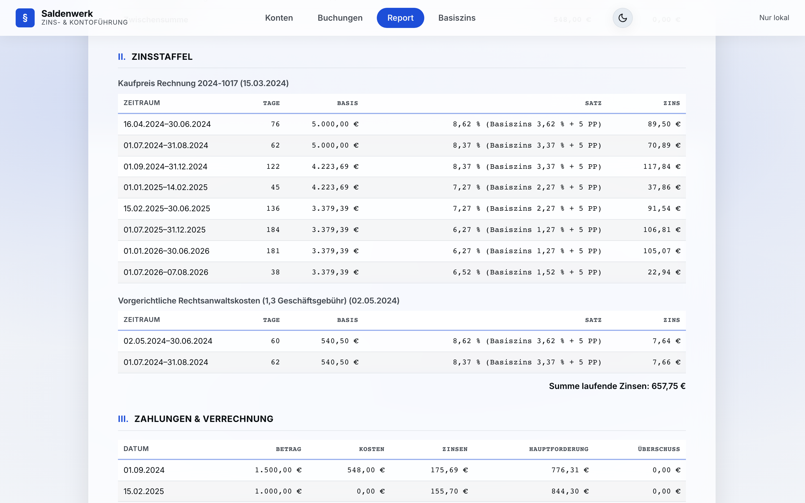

# 6 — Report, PDF & Antragstext

Die Ansicht **Report** erzeugt aus dem geöffneten Konto die fertige
Forderungsaufstellung — als Querformat-Blatt, wie es auch gedruckt bzw.
als PDF ausgegeben wird.

## Stichtag

Oben wählen Sie den **Stichtag** (voreingestellt: heute). Alle Zinsen
laufen bis einschließlich Stichtag; Zahlungen nach dem Stichtag bleiben
unberücksichtigt. So lässt sich der Forderungsstand für jeden beliebigen
Tag ermitteln — etwa den Tag der Antragstellung.

## Aufbau des Reports

1. **Forderungsaufstellung** — Haupt-, Neben- und Zinsforderungen mit
   Ursprungsbetrag und offenem Rest, jeweils mit Zwischensummen.
2. **Zinsstaffel** — für jede verzinste Forderung die vollständige
   Herleitung: Zeitraum, Zinstage, Basis, Zinssatz (bei Basiszins-Kopplung
   inklusive des jeweils gültigen Halbjahressatzes) und Zinsbetrag je
   Segment. Jede Zahl ist damit nachrechenbar — auch für die Gegenseite
   und das Gericht.
3. **Verrechnung der Zahlungen** — je Zahlung die Aufteilung auf Kosten,
   Zinsen und Hauptforderung nach der gewählten Tilgungsreihenfolge
   (§ 367 bzw. § 497 Abs. 3 BGB; die angewandte Reihenfolge steht im
   Report-Kopf).
4. **Endsaldo** — der offene Gesamtbetrag zum Stichtag.

So sehen Zinsstaffel und Verrechnungsübersicht aus — jedes Segment mit
Zeitraum, Tagen, Basis, Satz und Zinsbetrag:

## PDF herunterladen

**PDF herunterladen** erzeugt sofort eine PDF-Datei im Download-Ordner —
ohne Druckdialog. Die PDF ist ein zweiseitiges A4-Querformat-Dokument im
Kanzlei-Stil: Kontoblatt mit Zinsstaffel-Details plus Summenseite mit
Salden-Diagramm. Der Dateiname folgt dem Muster
`Forderungsaufstellung_<Aktenzeichen>_<Stichtag>.pdf`.

## Drucken

**Drucken** öffnet den Druckdialog des Browsers mit derselben
Querformat-Aufstellung — für Papierakte oder „Als PDF sichern" über den
Browser. Druck und PDF sind unabhängig vom Farbschema der App immer
schwarz auf weiß.

## Antragstext kopieren

**Antragstext kopieren** erzeugt einen fertigen Tenor-Text für
Mahnbescheid oder Klageantrag und legt ihn in die Zwischenablage:
nummerierte Forderungen, Zinsklauseln („nebst Zinsen in Höhe von …
seit …") und Abzugsklauseln für Teilzahlungen. Den Text fügen Sie direkt
in Ihr Schriftsatz-Dokument oder das Mahnbescheids-Formular ein — bitte
vor Verwendung fachlich prüfen.

---

Weiter: [7 — Basiszinssatz](07-basiszins.md) · [Zur Übersicht](README.md)
