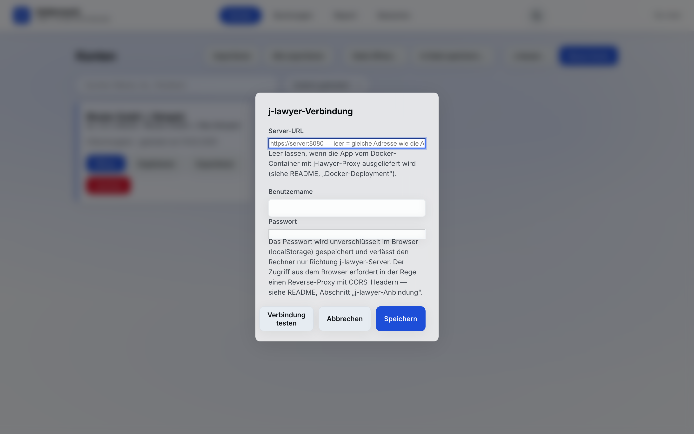

# 9 — j-lawyer-Anbindung

Saldenwerk verbindet sich auf Wunsch mit einem
[j-lawyer.org](https://www.j-lawyer.org)-Server — der freien
Kanzleisoftware. Die Anbindung ist optional; ohne Konfiguration bleiben
die j-lawyer-Knöpfe schlicht funktionslos bzw. ausgeblendet.

## Einrichten

Konten-Ansicht → **j-lawyer…** öffnet den Verbindungsdialog:



- **Server-URL** — die Adresse des j-lawyer-Servers. Läuft Saldenwerk als
  Docker-Container mit j-lawyer-Proxy (siehe
  [Installation auf einem Server](02-installation.md)), bleibt das Feld
  **leer** (= gleiche Adresse wie die App).
- **Benutzername / Passwort** — der j-lawyer-Benutzer braucht die Rollen
  `readArchiveFileRole` und `writeArchiveFileRole`.
- **Verbindung testen** prüft die Zugangsdaten und meldet Fehler
  verständlich klassifiziert (Anmeldung, Berechtigung, CORS/Netzwerk,
  Zeitüberschreitung).

**Hinweis Zugangsdaten:** Das Passwort liegt unverschlüsselt im
localStorage des Browsers (eigener Schlüssel; es landet **nicht** in
Exporten oder der Speicherdatei). Auf geteilten Rechnern bewusst
entscheiden.

## Stammdaten aus der Akte übernehmen

Im Dialog **Kontodaten** sucht **Aus j-lawyer übernehmen** die Akte zum
eingetragenen Aktenzeichen und füllt Gläubiger und Schuldner (Annahme:
Mandant = Gläubiger, Gegner = Schuldner — bitte prüfen, die Felder bleiben
editierbar). Passen mehrere Akten zum Aktenzeichen, erscheint eine
Auswahlliste.

## Forderungsaufstellung in die Akte laden

**An j-lawyer senden** in der Report-Ansicht lädt drei Dokumente in die
Akte:

1. die **PDF** (Kontoblatt + Summenseite),
2. eine eigenständige **HTML-Datei** der Aufstellung,
3. die **JSON-Sicherung** des Kontos (reimportierbar).

Bereits vorhandene Dateinamen werden automatisch durchnummeriert, nichts
wird überschrieben.

## Technischer Hintergrund: CORS (für IT)

Der j-lawyer-Server sendet keine CORS-Header; Browser blockieren deshalb
direkte Anfragen aus einer Web-App. **Empfohlene Lösung ist das
Docker-Deployment** — dort reicht der Saldenwerk-Container die
j-lawyer-API unter demselben Origin durch, und CORS spielt keine Rolle.

Wer Saldenwerk ohne Docker direkt vom Dateisystem nutzt, braucht einen
Reverse-Proxy vor dem j-lawyer-Server, der die Header ergänzt, z. B. nginx:

```nginx
location /j-lawyer-io/ {
    proxy_pass http://JLAWYER-SERVER:8080/j-lawyer-io/;
    add_header Access-Control-Allow-Origin * always;
    add_header Access-Control-Allow-Methods "GET, PUT, OPTIONS" always;
    add_header Access-Control-Allow-Headers "authorization, content-type" always;
    if ($request_method = OPTIONS) { return 204; }
}
```

(`*` ist hier nötig, weil die App unter `file://` den Origin `null`
sendet; sie nutzt kein `credentials: 'include'`, der Authorization-Header
wird explizit gesetzt.) In den Einstellungen dann die Proxy-URL eintragen.

---

Weiter: [10 — Anpassung & Betrieb](10-anpassung.md) · [Zur Übersicht](README.md)
