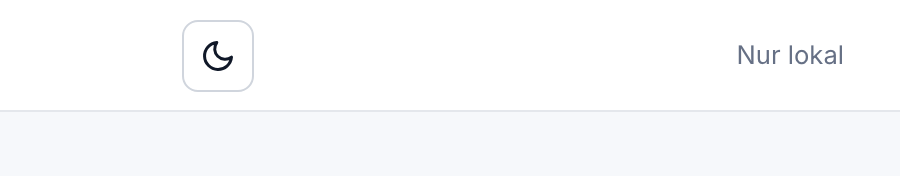

# 10 — Anpassung & Betrieb

## Hell- und Dunkelmodus

Saldenwerk folgt automatisch der Hell/Dunkel-Einstellung Ihres
Betriebssystems. Der **Sonne/Mond-Knopf** in der App-Leiste schaltet
manuell um; die Wahl wird im Browser gespeichert und gilt auch nach dem
Neustart. Druck und PDF sind davon unabhängig — sie sind immer schwarz auf
weiß.




## Öffentliche Variante (für Betreiber / IT)

Saldenwerk kann als kostenloses öffentliches Angebot gehostet werden — es
speichert prinzipbedingt keine Nutzerdaten auf dem Server. Dazu in
`konfig.js` umstellen:

```js
window.Konfig = { oeffentlich: true };
```

Im öffentlichen Modus erscheint eine Fußzeile mit Haftungshinweis und
Links auf `impressum.html` und `datenschutz.html`. **Vor der Veröffentlichung** die
`[PLATZHALTER]` in beiden Rechtsseiten mit den echten Betreiberangaben
füllen und fachlich prüfen (Impressumspflicht nach § 5 DDG,
DSGVO-Informationen, Logdaten-Abschnitt ans Hosting anpassen).

## Eigenes Branding (für Betreiber / IT)

Name, Logo, Claim, Farbschema und (im öffentlichen Modus) eine
Kontakt-Box in der Fußzeile lassen sich ohne Codeänderung konfigurieren.
Das vollständige Schema ist in `konfig.js` dokumentiert:

```js
window.Konfig = {
  oeffentlich: true,
  branding: {
    name: 'Mein Forderungsrechner',
    logo: 'branding/logo.png',
    claim: 'Forderungen & Zinsen berechnen',
    beschreibung: 'Meta-Description für Suchmaschinen',
    farben: { '--farbe-akzent': '#1e7034' },
    kanzlei: { name: '…', text: '…', url: '…', telefon: '…', logo: '…' },
  },
};
```

Die Akzentfarbe färbt die aktive Navigation, Links, den Fokusrahmen und die
Akzentkante der Konto-Karten — im hellen wie im dunklen Modus (für den
Dunkelmodus wird der Wert automatisch aufgehellt). Die Primär-Buttons
bleiben bewusst im neutralen Markenschema (dunkles Navy bzw. Hell im
Dunkelmodus), damit sie zu jeder Akzentfarbe kontrastreich bleiben. Bitte
eine Farbe mit ausreichend Kontrast wählen (WCAG AA).

Beim Docker-Deployment werden Konfiguration und Logo ohne Neu-Build per
Volume eingebunden:

```yaml
volumes:
  - ./meine-konfig.js:/usr/share/nginx/html/konfig.js:ro
  - ./mein-branding:/usr/share/nginx/html/branding:ro
```

Das vollständige Corporate Design (Logos, Farbtokens, Gestaltungsregeln)
liegt im Ordner `saldenwerk-ci/` des Repositorys.

## Tests (für Entwickler)

```
node --test tests/*.test.js
```

Die Tests decken Datums-/Betragsformatierung, Basiszins-Tabelle,
Zins- und Kontoberechnung, Druckmodell, PDF-Export und die
Export/Import-Validierung ab. Beiträge gern als Pull Request — Saldenwerk
ist MIT-lizenziert.

---

Weiter: [11 — Rechenkonventionen](11-rechenkonventionen.md) · [Zur Übersicht](README.md)
